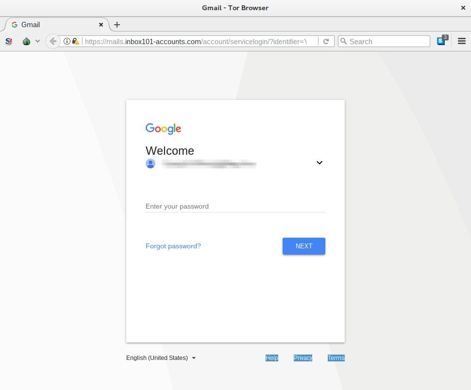

# Password-Stealing Phishing

Password-Stealing Phishing is the most traditional form of phishing attack. It relies on tricking the target into providing their passwords by luring them to clones of the login prompts of a legitimate site. These fakes are normally generated by modifying HTML templates that resemble as much as possible the original cloned site. Following is an example of a rather realistic-looking clone of Gmail used in a targeted phishing campaign in the Middle-East:

*Image from [Amnesty International](https://www.amnesty.org/en/latest/research/2018/12/when-best-practice-is-not-good-enough/)*

The quality and sophistication of this form of phishing attack depends on the attacker's attention to detail in the creation of the clones and on the extent to which the phishing kit emulates the behavior of the original website. Consequently, this classic form of phishing attack can range from being trivially obvious to very deceitful. For example, the more dedicated attackers would create phishing pages pre-compiled with the target's email address and even the target's profile picture, as well as any other detail to lower any suspicion. Even better attackers, as we discuss more in detail letter, might also be capable of bypassing the most common forms of two-factor authentication.

Although it doesn't properly fit into this category, an evolved version of this form of attack is **session riding** or **session hijacking**. With session riding the attacker, instead of having to recreate as accurately as possible a clone of the original site, creates a "reverse proxy" that simply sits in between the target and the legitimate service, and is able to intercept session tokens that allow them to authenticate to the victim's account. This technique is for example implemented in the open source tool Evilginx2 and is explained in greater detail [here](https://breakdev.org/evilginx-2-next-generation-of-phishing-2fa-tokens/).

Because session riding relies on intercepting authentication to the original service website (such as Gmail or Facebook), the *only* visible clue that the website they are visiting is not the original is the domain name in the browser's address bar.
